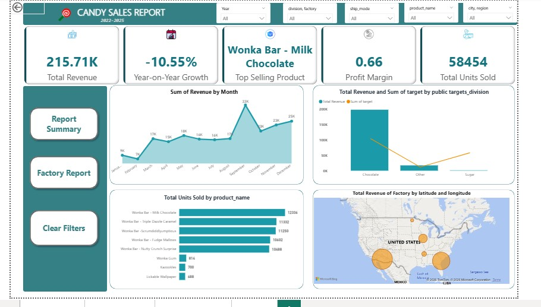

# Wonka-Enterprises-Business-Intelligence-Analysis




## Overview
An end-to-end Business Intelligence project analyzing sales, profitability, customer behavior, and operational performance at Wonka Enterprises using SQL and Power BI.

The project covers:
- SQL database design and business analysis
- Power BI data modeling and dashboard development
- KPI tracking and strategic business insights

---

# Tech Stack
- SQL / MySQL
- Power BI
- DAX
- Star Schema Data Modeling

---

# Dataset Structure

### Tables
- `products`
- `sales_data`
- `factories`
- `targets`

The dataset contains sales transactions, product information, factory operations, customer data, and revenue targets.

---

# Project Workflow

## 1. SQL Data Analysis
- Database creation and table setup
- Data cleaning and validation
- Revenue and profitability analysis
- Customer and operational analysis

Example query:

```sql
SELECT COUNT(*) 
FROM sales_data;
```

---

## 2. Power BI Development
- Star schema modeling
- DAX measure creation
- KPI dashboard design
- Interactive visualizations

### Key KPIs
- Total Revenue: **$215.71K**
- Units Sold: **58,454**
- YoY Growth: **-10.55%**
- Profit Margin: **0.66**

---

# Key Insights

- The **Chocolate division** generated **91.7%** of total revenue.
- **Everlasting Gobstoppers** had the highest profit margin (**80%**).
- **Kazookles** underperformed with a low margin (**7.69%**).
- Revenue peaked during **September** and **December**.
- The **Lot’s O’Nuts factory** handled nearly **50%** of total production volume.
- Standard Class shipping generated **$131K** in revenue.

---

# Dashboard Features
- Revenue trend analysis
- Product profitability tracking
- Geographic performance mapping
- Customer insights
- Target vs Actual analysis

---

# Future Improvements
- Predictive sales forecasting
- Inventory optimization
- Real-time reporting integration


